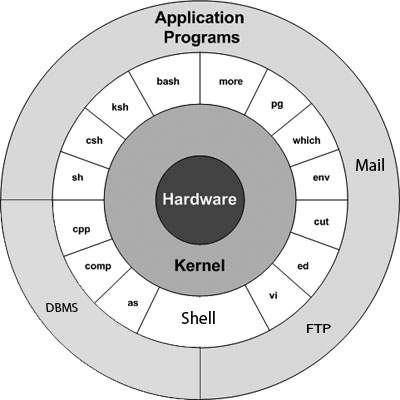

 

Unix tutorial for Beginners
=====================

Introduction to Unix Operating System
=====================

Beginners guide to Unix
=====================

 

Description
---------------------

About the Course/Tutorial
---------------------

What will learn and cover
---------------------

Welcome to the new tutorial on Unix, a beginner's guide to Unix. Let us learn/understand the essentials and basic concepts of the Unix Operating System with hands-on examples.

In this introductory Unix module will learn:
- What is the Operating System
- Unix Operating System
- Features of Unix
- Unix System Architecture
- Different variations/flavors of Unix
- Unix File System
- Unix Commands

Topics (separate with spaces)
---------------------

Add topics to categorize your repository and make it more discoverable:

- unix
- operating-system
- unix-operating-system
- unix-shell
- unix-command
- unix-features
- unix-architecture

Welcome
---------------------

Hi All, I'm **`Dinanath Jayaswal, Senior UI/Web Developer and Adobe Certified Expert Professional`**, I wanna welcome you to the `Introduction to Unix Operating System/Unix tutorial for Beginners`.

Who is this for? Audience
---------------------

This Course/Tutorial is ideal for: 
- Freshers
- Intermediates
- Beginner Programmers
- Any Developer/Designer

Course/Tutorial achievement
---------------------
Course/Tutorial Goal
---------------------

<!-- After completing/attending/finishing this Course/Tutorial, participants should be able to: -->
By the end of this series, you will be able to understand:
- What is the Operating System
- Unix basics and advanced concepts
- Unix Architecture
- Unix Command usage

Prerequisites for current course / What you need to know
---------------------

- Computer Basics

Topics included/covered
=====================
1. [Introduction to Operating System](#1-introduction-to-operating-system)
    - 1.1. [What is OS (Operating System)](#11-what-is-the-operating-system)
    - 1.2. [Functions of Operating System](#12-functions-of-operating-system)
    - 1.3. [Popular Operating System](#13-popular-operating-system)
2. [Introduction to Unix](#2-introduction-to-unix)
    - 2.1. [History of Unix Operating System](#21-history-of-unix-operating-system)
    - 2.2. [Features of Unix](#22-features-of-unix)
    - 2.3. [Compare different Operating System (MS-DOS, MS-Windows, Unix)](#23-compare-different-operating-system)
    - 2.4. [Difference between different Operating System (Unix, MS-DOS, MS-Windows)](#24-difference-between-different-operating-system)
3. [Unix Architecture](#3-unix-architecture)
    - 3.1. [Different flavors/variations/varieties/versions of Unix](#31-different-flavors-of-unix)
    - 3.2. [Unix System Architecture-Structure](#32-unix-system-architecture-structure)
      - 3.2.1. [Kernel](#321-Kernel)
      - 3.2.2. [Shell](#322-shell)
      - 3.2.3. [Programs](#323-programs)

1 Introduction to Operating System
=====================

In this section, you will be able to understand the fundamentals of Operating Systems, its functions and various Operating Systems used in the world.

1.1. What is the Operating System
---------------------
1.1. What is OS (Operating System)
---------------------

 <figure>
  
 </figure>

- OS (Operating System) is a set of programs/package acts as an intermediary/interface between computer software, end-user and computer hardware
- An operating system (OS) is a collection of `system software` that manages `computer hardware, software resources`, and provides common services for computer programs
- Programs which helps to manage/communicate between software and hardware (low-level software manages hardware by controlling the execution of programs)
- Core/brain/heart of machine's/device's software and provide an environment to execute programs
- OS (Operating System) controls the allocation of resources and services such as (Memory, Processor, Devices, Information, controlling attached devices/peripherals)

  <figure>
    &nbsp;&nbsp;&nbsp; 
    <figcaption>&nbsp;&nbsp;&nbsp; Image 1.1 - Operating System </figcaption>
  </figure>

1.2. Functions of Operating System
---------------------

**Here is the list of important functions performed by an Operating System**:

- Co-ordination between Software and Hardware
- Memory Management
- Device Management
- Processor Management
- Security
- Error detection
- Co-ordination between User and Software
- Control over system performance
- Task/Internal Job scheduling
- File Management

  <figure>
    &nbsp;&nbsp;&nbsp; 
    <figcaption>&nbsp;&nbsp;&nbsp; Image 1.2 - Operating System - Functions </figcaption>
  </figure>

1.3. Popular Operating System
---------------------

**Here are some popular and widely used Operating Systems (OS) - Some popular Operating Systems include**:

- Unix
- DOS
- Microsoft Windows
- macOS (Apple mac)
- Linux (Unix clone)
- Android (Mobile OS)
- iOS (Apple Mobile OS - iPhone, iPad, iPod)

2 Introduction to Unix
=====================
 
In this section, you will be able to understand the basic concepts-history of Unix operating systems, features of Unix, along with its comparison, similarities and difference between other Operating Systems in the market like MS-DOS and MS-Windows.

2.1. History of Unix Operating System
---------------------

- Unix is developed by `Ken Thompson` and `Dennis Richie` at `AT&T Bell Laboratories Research Center, USA` in the year `1969`
- Unix is multi-user, multi-tasking, and multi-processing, high-function, interactive Operating System
- Unix is terminal ie. command prompt based `Command Line Interface/Interpreter (CLI)`, UNIX system also have a `Graphical User Interface (GUI)` similar to Microsoft Windows which provides an easy to use environment
- Initially, Unix was written in Assembly language, First Operating System is written in HLL ie. High-Level Language (C)
- Originally Unix is spelled as `UNICS (Uniplexed Information Computing System/Service)`
- Later Unix is re-written in `C` language and renamed as `Unix`
- Some of Unix OS ie. distributions are Free (Open Source - Linux) and some are not free (license needed)

2.2. Features of Unix
---------------------

**Mentioned below the features and capabilities supported by Unix Operating System**:

- Multi-user capability
- Multi-tasking
- Multi-process
- Hierarchical File Structure / Hierarchical File System
- Open Source System
- Portability
- Programming Utility/Facility
- Communication Facility
- Security
- Tools and Utilities
- Piping (Pipes & Filters)
- Help Facility - Integrated Help
- Modularity
- Unix Shell  
- **Multi-user capability**
  - Multiple ie. many users can use the machine simultaneously supported via terminals/command prompt
- **Multi-tasking**
  - Multiple programs can be run at a time
- **Multi-process/Multi-processing**
  - Each user can execute multiple/many/several processes simultaneously
- **Hierarchical Structure**
  - Unix directories/folders system are present like a tree structure to support, organize and maintain files
- **Open Source System**
  - Some of Unix OS ie. distributions are Free (Open Source - Linux), users can modify source code as per needs and requirements
- **Portability**
  - Unix allows users to transfer data/information/files/folders from one system to another
- **Programming Utility/Facility**
  - Unix Shell can be used as a Programming/Scripting Language
- **Communication Facility**
  - Communication between different users is possible by using/sharing some information
- **Security**
  - Unix Operating System provides System-level security controlled by the system administrator and file-level security controlled by the owner of the file/folder
- **Tools and Utilities**
  - Supports/provide many useful tools/software/utilities used for software development
- **Piping**
  - The output of the current command can be used as an input of next command/process (last-current-next process/command can be linked/chained)
- **Help Facility - Integrated Help**
  - Unix `man` command is used to get/view any command help
- **Modularity**
  - Unix Operating System consists of multiple independent modules/programs/utilities which perform a specific task
- **Unix Shell**
  - Unix Shell a command interpreter that helps to interact with Unix OS ie the Kernel. (Shell takes input/command from a user and executes programs-run command)
  
2.3 Compare different Operating System
---------------------
2.3. Compare different Operating System (MS-DOS, MS-Windows, Unix)
---------------------
2.3. The similarity between different Operating System (MS-DOS, MS-Windows, Unix)
---------------------

**Similarity between Unix and MS-DOS**:

- `Command Line Interface CLI` / Command Terminal Window / Command Prompt
- `I/O (Input Output)` redirection concepts
- `Hierarchical directory` structure (Root directory at the top)
- Read-Write (RW) and execute permissions on files/folder
- Wildcard Character support

**Similarity between Unix and MS-Windows**:

- `Graphical User Interface (GUI) `
- `Multi-tasking` Operating System
- Built-in networking with `TCP/IP` as the standard protocol

2.4. Difference between different Operating System
---------------------
2.4. Difference between different Operating System (Unix, MS-DOS, MS-Windows)
---------------------

**Difference between Unix and MS-DOS**:

| Unix                               | MS-DOS                            |
| ---------------------------------- | --------------------------------- |
| Unix can have a `GUI (Graphical User Interface)   `                      | MS-DOS does not have a GUI, it is Terminal or Commands base, `CLI (Command Line Interface) `                                                        |
| Unix is `case-sensitive `                                                | DOS is `case-insensitive (NOT case sensitive)`                         |
| Unix is a `Multi-User`, `Multi-Tasking` and `Multi-Process` Operating System | DOS is a `Single-User`, `Single-Tasking` and `Single-Process` Operating System |
| Unix uses `forward slashes (/)` to separate directories                | DOS uses `backslashes (\)` to separate directories                       |
| Unix is mainly used in Servers                                         | DOS is used in Embedded Systems                                          |
| Unix OS uses concepts like Process priorities                          | DOS does NOT use concepts like Process priorities                       | 
| Unix has a `Shell Script`                                                | MS-DOS has a `Batch files`                                             |
| | |

**Difference between Unix and MS-Windows**:

| Unix                               | MS-Windows                        |
| ---------------------------------- | --------------------------------- |
| Unix is a `CUI (Command User Interface)` OS, it can have GUI             | Windows is a `GUI (Graphical User Interface)` OS                       |
| Unix is a` Multi-User` and `Multi-Tasking` OS                          | MS-Windows is a `Single-User` and `Multi-Tasking` OS                     |
| Unix is `case-sensitive`                                                 | MS-Windows is `case-insensitive` (NOT case sensitive)                  |
| Unix is `NOT User friendly as it is not full of GUI` (Graphical User Interface)                                                               | Windows is `User friendly as its fully GUI` based                        |
| Unix is `free, Open Source`, No license needed                           | Windows is a `licensed` OS |
| Unix `supports programming` facility                                   | Windows `do not supports` programming facility                           |
| Unix file system is a `Hierarchical` Model                             | Windows file system is a `Flat` Model |
| Unix has a `dumpty terminals (without HDD Hard Disk)`                  | Windows do not support dumpty terminals                                  |
| Unix is `open source but has many/multiple vendors`, who takes source code add models and create modules/variations/versions/distributions     | Windows have only one owner/vendor ie. `Microsoft Corporation`           |
|  | |

3 Unix Architecture
=====================

In this section, will get more information on different Unix flavors/variations/variety/version, Unix Architecture with Kernel and Shell.

3.1. Different flavors of Unix
---------------------

3.1. Different variations/varieties of Unix
---------------------

There are many ie. different flavors/variations/variety/versions of UNIX available in the market, although they share common similarities. The most popular varieties of UNIX are Sun Solaris, GNU/Linux, and macOS X:

| Vendor/Organization       | Unix OS flavors/variations/variety  |
| ------------------------- | -------------------------- |
| Amdahi Corporation        | UTS  |
| AT&T                      | Vr4, BSD Unix, DEC Unix, macOS X, SCO Unix |
| Compaq                    | Tru64Unix    |
| HP                        | HP-UX  |
| IBM                       | AIX |
| Microsoft                 | Xenix  |
| Red Hat                   | Linux |
| SGI (Silicon Graphics) | TRIX  |
| SCO (Santa Cruz Operation) | SCO Unix |
| Sun                       | Solaris |
|                           | Ubuntu  |
|                           | Fedoro |
|                           | Novell |
|                           | Xubuntu |
|                           | Kubuntu |
|                           | XandOS  |
|                           | Lunar |
|                           | FreeBSD |
|                           |  |

3.2. Unix System Architecture-Structure
---------------------

An operating system is a collection of software, each designed for a specific function. Here is a basic block diagram of a Unix system Architecture-Structure:

  <figure>
    &nbsp;&nbsp;&nbsp; 
    <figcaption>&nbsp;&nbsp;&nbsp; Image 3.2 - Unix Architecture | Unix system Architecture-Structure </figcaption>
  </figure>

> #### Hardware (Physical Devices)
- The Hardware layer of the Unix Operating System controls the use of physical system resources, such as memory manager, process manager, disk drivers, devices, and so on
- The hardware consists of all input and output peripheral devices (RAM, HDD, CPU and so on)

The UNIX operating system is made up of three parts named as `the Kernel, the Shell and the Programs`:
1. Kernel
2. Shell
3. Programs

> #### 1. Kernel
- The kernel is the hub/heart/core of Unix Operating System

> #### 2. Shell
- Shell is an interface between a User/User application and Kernel

> #### 3. Programs / User-Application Program
- Utility programs and applications are given by the user are handled in this layer

### 3.2.1. Kernel

- The kernel is the hub/heart/core of Unix Operating System
- It acts as an interface between the Hardware and Shell layer
- It allocates the time and memory to the programs and handles the communications in response to the system calls
- Most of the tasks such as memory management, task scheduling, file management, and so on are performed by Kernel
- It manages external commands in Unix
- Manages system resources, and enforce the security scheme
- Manages the machine's memory and allocates it to each active/currently running process
- Manages processor interrupts, and takes care of error handling
- Schedules the work is done by the Central Processing Unit CPU and controls how processes are executed
- Manages the creation and terminations of processes, and the communication between processes
- Allocates and manages resources used by each user
- Allows user processes, including shell commands to run Kernel instructions

### 3.2.2. Shell 

- Shell is an interface between a User/User application and Kernel
- Shell is the `command interpreter in Unix`, it supports a Command Line Interface, and also allows scripting
- It serves as the interface between the User and the Kernel, helps to interact with Unix OS ie the Kernel (Shell takes input/command from a user and executes programs-run command)
- The Shell is a Command Line Interface (CLI), As and when we type a command at the terminal, the shell interprets the command and calls the corresponding program
- The Shell layer processes the user request
- Shell uses standard syntax for all the commands
- It provides a rich set of commands
- Shell is an environment in which we can run our commands, programs and shell scripts
- A file `"/etc/shells"` contains a list of all the Shells supported and available in the system

**Different Shells available with most of the Unix variants/flavors: (Shell Types / Shell variants)**
- Bourne shell (sh)
- C shell (csh)
- Korn shell (ksh)
- TelShell (wish)
- Bourne Again Shell (bash)

### 3.2.3. Programs 
### 3.2.3. Programs / User-Application Program

- Utility programs and applications are given by the user are handled in this layer
- The commands are themselves called as programs in Unix
- There are various commands and utilities which you can make use of in your day to day activities. `cp, mv, cat` and `grep`, etc.
- Data in Unix are organized into files and files are organized into directories which are further organized into a tree-like structure called as the `file system`

